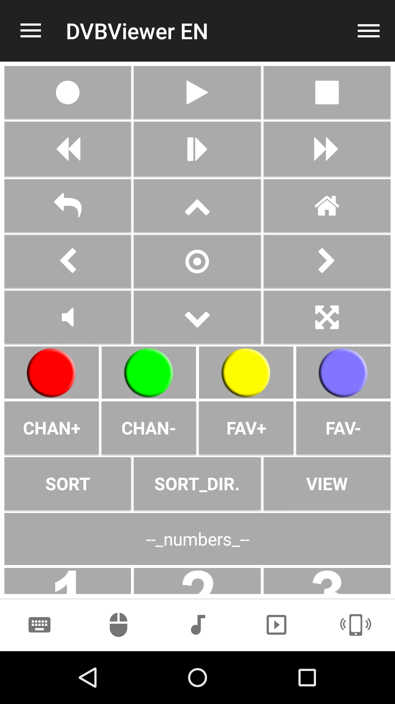
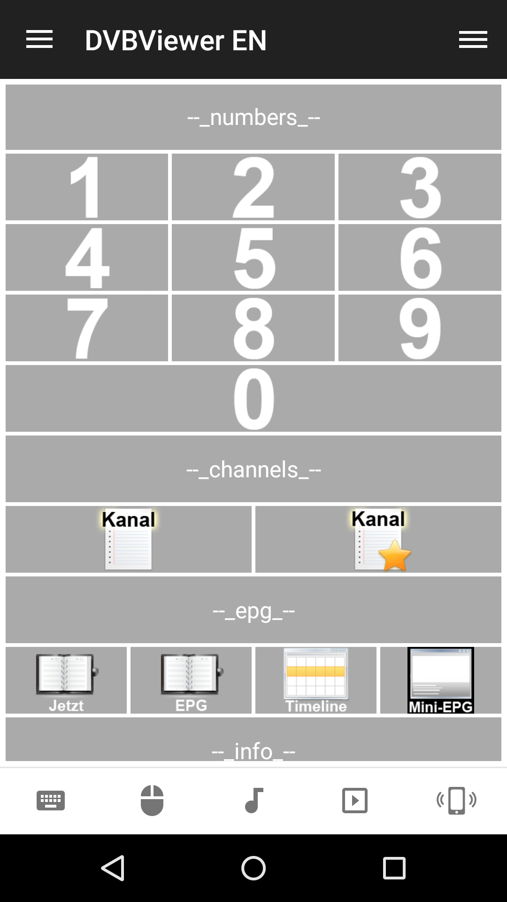
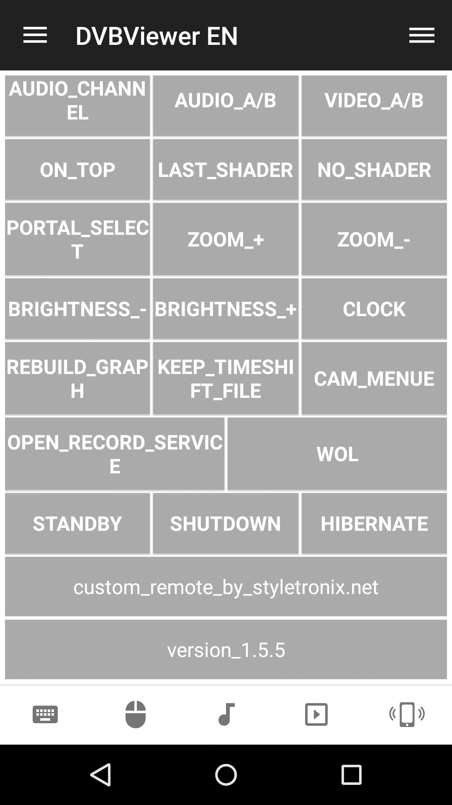

# DVBViewer
User contributed remote control for the DVBViewer player
http://www.dvbviewer.com/en/index.php

## Features
*  Navigate (up, down, left, right)
*  Seek (forward, backwards)
*  Toggle play, pause, record
*  Open EPG, Timeline, Mini-EPG
*  Zoom (in, out)
*  Channel (next, previous)
*  Manage playlists
*  And much more...

## Screenshots

## Support
Developed and maintained by **Styletronix**  
https://www.styletronix.net/
