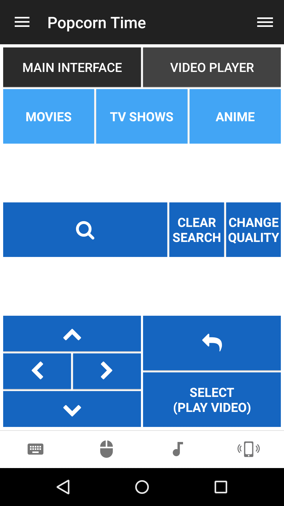
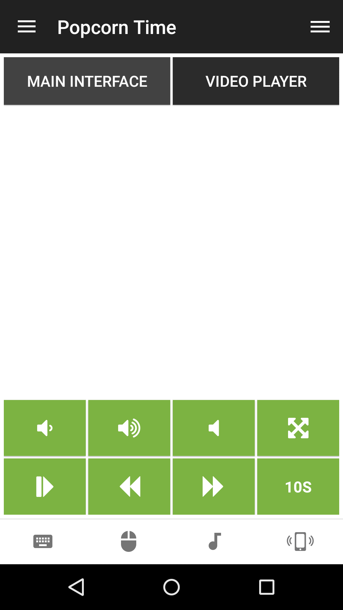

# PopcornTime Remote
A simple keyboard mapped remote for [PopcornTime](https://popcorntime.io)

## Features
* **Main Interface tab** - Search videos, Navigation controls, Tab selection
* **Video Player tab** - Control playback, Volume, Fullscreen toggle, Skip back/ahead

## Future features
PopcornTime remote was made with keyboard input in mind, when PopcornTime hopefully matures with an API the remote will be updated to replace keyboard input with an interface that reflects PopcornTime's UI.

## Screenshots
 
