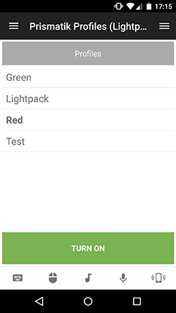

# Prismatik Profiles Remote
Simple remote to control the Prismatik Profiles over TCP. I built this to annoy my coworkers as much as possible. 

## Features
* Get Profiles from Prismatik
* Select Profile
* Turn on/off Profile

## Requirements
 * Have Prismatik compatible light set (e.g. LightPack.tv)

## Setup
 1. Open Prismatik settings
 2. Go to experimental
 3. Check "Enable server (API via sockets)"

## Todo
 * Improve interface
 *  Manually switch colors

## Screenshots

